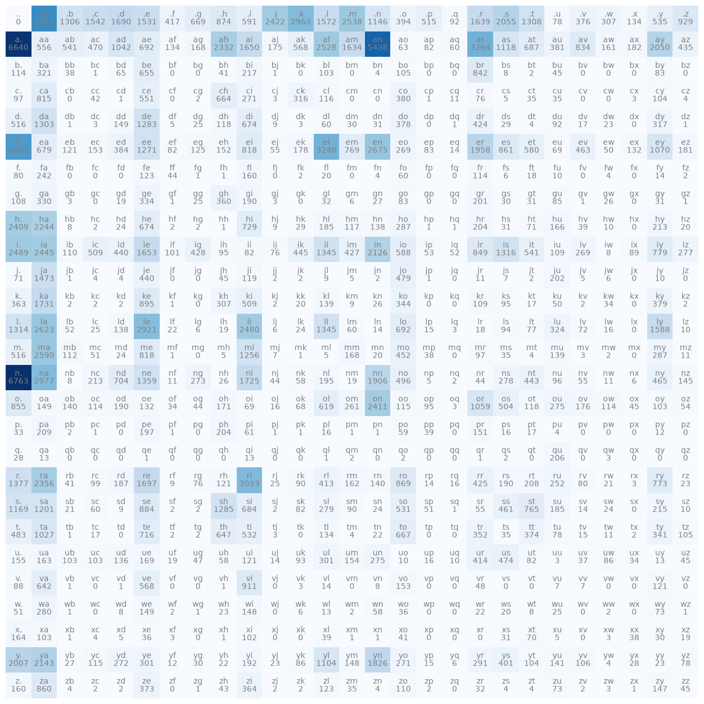
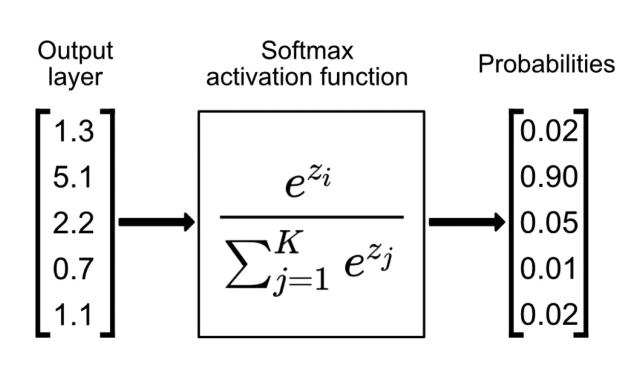
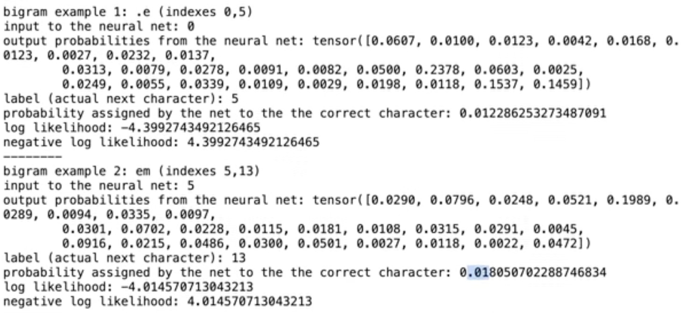

# Makemore - Part 1

Part 1 of makemore is a bigram language model. It is trained and tested on a dataset of 32,000 names with the purpose of generating new names that are similar to those in the dataset. It does this by learning how to predict the next character given the previous character.

There are 26 characters in the English alphabet that we care about. We also add start/end token symbolized by '.'. This is important because it's significant to the generation of new names which characters typically appear at the the start of names and which typically appear at the end.

## Non-ML Approach

A non-ML approach to solving this problem is looking through the whole dataset of names and counting how many times each character pairing occurs. Because the number of names in the dataset is so massive, we get an approximation of the probability of that a given character follows some other character.
When we do this we get the table shown below:



Reading this table, we see, for instance, that a appears at the end of a name (before the . character) 6640 times. The benefit of having this table is that we can sample from it to simulate picking a next character (given a previous character) according to a probability distribution modeling how names are built.

The process of generating a name by hand is that we first start in the row corresponding to '.'. This is the first row of the table. Then according to the probability distribution of the row, we pick some character to be next. For instance, we may pick 'm', which occurs with probability approximately 10%. Then we go to the row corresponding to 'm' and sample from its distribution to get the next character. It seems like 'a' commonly follows 'm', so we may get 'a'. Then we go a's row and continue this process until we reach a row and sample the ending character. At this point we stop and the sequence of characters we get is the name we generated.
The loop for doing this is:

```python
g = torch.Generator().manual_seed(2147483647)

P = N.float()
P /= P.sum(1, keepdim=True)

for i in range(20):
    out = []
    ix = 0
    while True:
        p = P[ix]
        ix = torch.multinomial(p, num_samples=1, replacement=True, generator=g).item()
        out.append(itos[ix])

        if ix == 0:
            break

    print(''.join(out))
```

Where N is matrix corresponding to the probabilty table shown above. out is an holding the characters that generate. Then we start with ix = 0, which means we start in the row corresponding to '.', the start token. P is a row-normalized version of N. Then at each iteration of the loop, get the row for the current character (called p) and get the next character by sampling from that row. This is then append to the name that we're generating. The while loop breaks when we have `ix == 0`, which means we generating the ending character. The code above generates 20 names.

## Negative Log-Likelihood

We can compute the probability that a given name is generating by our model by multiplying the probabilties of the character pairings. For instance, if we wanted to know the probability that your model generates the name "emma", we would multiply the probabilities of generating ".e", "em", "mm", "ma", "a." in succession. We get each of the these individual probabilities by looking at the corresponding cell in our table.

The issue with calculating probabilities like this is that we're multiplying several very small number, which gives us an even smaller number.
To fix this, we can take the log of the probabilities. Rather than multiplying the individual probabiltiies, it will sum them.

The maximum value of the log-likelihood is 1, since that occurs when all the individual probabilities are 1 (and the log of 1 is 0), so the log-likelihood will typically be negative. When testing our model, it's best if each individual probability is as close as possible to 1, since that means our model is very good at predicting the next character in this instance. Therefore, a greater log-likelihood means our model is doing better.

Recall that with a loss function, we want to minimize it (you want to minimize the loss). Therefore, to use log-likelihood in a loss function, we actually care about the negative log-likelihood. In practice, we try to minimize the average negative log-likelihood (just divide the nll by the number of training points).

The lower the negative log-likelihood, the better our model performs.

## Neural Network Approach

The neural network receives a single character as input and outputs the probability distribution for the next character. Our loss function is the negative log-likelihood, so we can use stochastic gradient descent to tune the parameters of the model to minimize the negative log-likelihood.

The first step is to create the training set:

```python
xs, ys = [], []

for w in words:
    chs = ['.'] + list(w) + ['.']

    for ch1, ch2 in zip(chs, chs[1:]):
        ix1 = stoi[ch1]
        ix2 = stoi[ch2]
        xs.append(ix1)
        ys.append(ix2)

xs = torch.tensor(xs)
ys = torch.tensor(ys)
```

The xs are the first character and the ys are the character that comes after the corresponding character in xs. We represent the characters in each array by their index in the English alphabet (plus the . character at the end).

When passing inputs to a neural net, we don't want to just pass integer values (which is the form that our data is currently in); instead, we'd like to pass tensors. To accomplish this, we convert all our inputs and outputs to one-hot encodings.

One-hot encodings are ways to represent values as a vector of dimension n, where exactly one of the positions is 1 and all other positions are 0. In our case, we want one-hot encodings with 27 classes. Then the vector with 1 in the first position may represent a (or 1). Each vector represents a single class (in our case, a character from the alphabet).

Neurons in a network perform some linear computation, then pass the result through an activation function. However, this doesn't occur in the input layer.

The first thing we can do is generate our hidden layer of neurons. This neural network will be very simple because the neurons in the hidden layer will process the inputs by applying no bias or activation function, just simple linear combination with the weights. `W = torch.randn((27,27), generator=g, requires_grad=True)` creates 27 neurons with weights sampled from a normal distribution. Each column reprensents the weights of a single neuron.

We get the outputs of our network by matrix multiplying the inputs (in one-hot encoding form) by the matrix of neuron weights. However, these outputs are not in the form of probabilities. At this phase, they are logits, which are the raw, unnormalized scores output by a neural network classifcation model.
Because they are both negative and positive, we can interpret them as "log-counts". So to the get the counts, we want to exponentiate them. Then to get the probabilities, we standardize by the dividing the sum of the counts. This process is shown below in the "foward pass".

```python
xenc = F.one_hot(xs, num_classes=27).float() # input to neural net as one-hot encoding
logits = xenc @ W # predict log counts
counts = logits.exp() # counts of bigram (not really but similar), equivalent to N
probs = counts / counts.sum(1,keepdims=True) #probabilities for next character
```

Consider what happens if we input exactly one training example (. e). This means that the first character is . and the corresponding output is e. The first thing we do is get the one-hot encoding of . (. is representing by 0 so its actually the encoding for 0). Then we pass this through the network. This is a 1x27 vector multiplied by a 27x27 matrix, to get a 1x27 vector. This vector is the logits. We exponentiate it to get the counts, then we divide by the sum of the entries in this resulting vector to get the probabilites. Then we interpret this probs vector as probability of each possible character being the next character.

Note that the last two steps in the code above is a softmax:



Which is a way of taking the vector from teh output layer and converting it into probabilties.



Consider the example shown above. We use our network to process some training examples and evaluate their negative log-likelihoods. The first example is (. e). This means the first character is e. Our network is initialized with random weights. The tensor shown represents the probabilities of each character coming after '.'. We care about the label corresponding to 'e' since that is the character that appears as the character after '.' in our training example. It has probability approximately 0.123. The negative log-liklihood is then about 4.4

For second training example, we care about our model predicting the probability that m comes after e since (e m) is our training example. This probability comes out to be 0.018, which is also quite bad and produces a negative log-likilihood of about 4.014. We continue doing this for every training example in the training dataset. If our training set has 100 examples, we sum the negative log-likelihood from all the examples, then divide by 100 to get the negative log-likelihood. This is the loss function we're trying to minimize.

The general flow of using the training data is that we get some training example like (x y). This means that y comes after x. Then we vector representation of x into our network and get back a probability distribution for how likely each character is to come after x. We don't care about all these numbers, just the one that corresponds to y. We then take the negative log of the probability corresponding to y, and that is metric for how well the model performs on this training example.

The training loop is:

```python
# gradient descent
for k in range(100):

    # forward pass
    xenc = F.one_hot(xs, num_classes=27).float() # input to neural net as one-hot encoding
    logits = xenc @ W # predict log counts
    counts = logits.exp() # counts of bigram (not really but similar), equivalent to N
    probs = counts / counts.sum(1,keepdims=True) #probabilities for next character
    loss = -probs[torch.arange(num), ys].log().mean()
    print(loss.item())

    # backward pass
    W.grad = None # set gradient to zero
    loss.backward()

    # update
    W.data += -50 * W.grad
```

Each iteration of the loop takes the entire set of inputs in one-hot encodings (in xenc) and puts it through the neural net. It reguarlizes the output to get probabiilties of the next characters. Each column in the probs array represents the probabilty distribution for the next character for the character in that training example. We then compute the loss by gettiing a vector corresponding to the probability that our model assigns to each corresponding output character from the training examples. We take the log of this vector, negate it, and get the mean, to get the average negative log-likelihood; a single number representing the performance of our model on the training set.
This represents the forward pass, where we're just evaluating our model by plugging in all the inputs.

The next step is backward propagation, where we compute the gradient for all the parameters. Finally, we update the parameters based on their gradients.

We perform this loop 100 times so that each time the loop runs, we get an improvement in the performance of our model. The average negative log-likelihood decreases.

As before, we can generate names using our model, which after being trained stores the probability that each character comes after a given character. We start by predicting the character that comes after '.', then the character that comes after that, and so on.

When we do this, you'll find that we get the same names generator (assuming you're using the same seed). This is because the neural network learns the probabilties that each character occurs, just like how we computed them by hand and predicted them that way.
