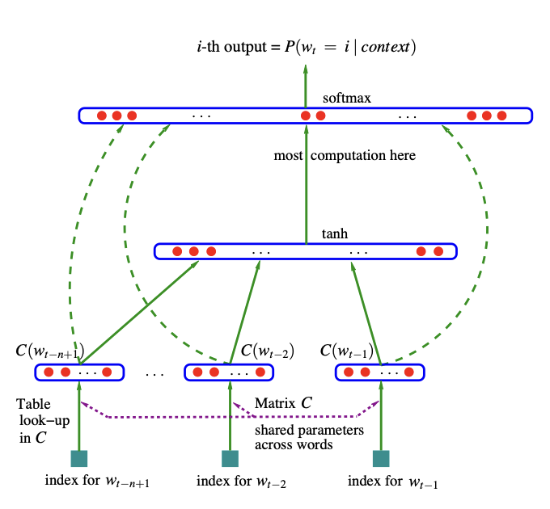
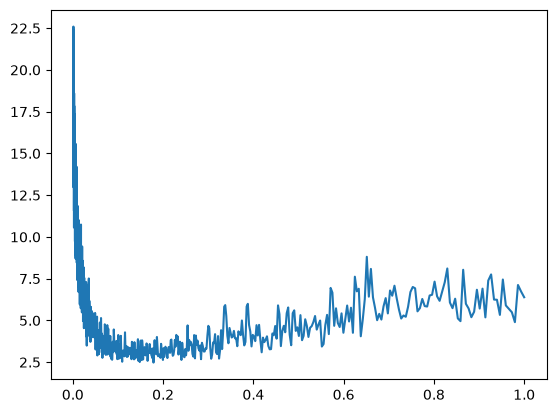
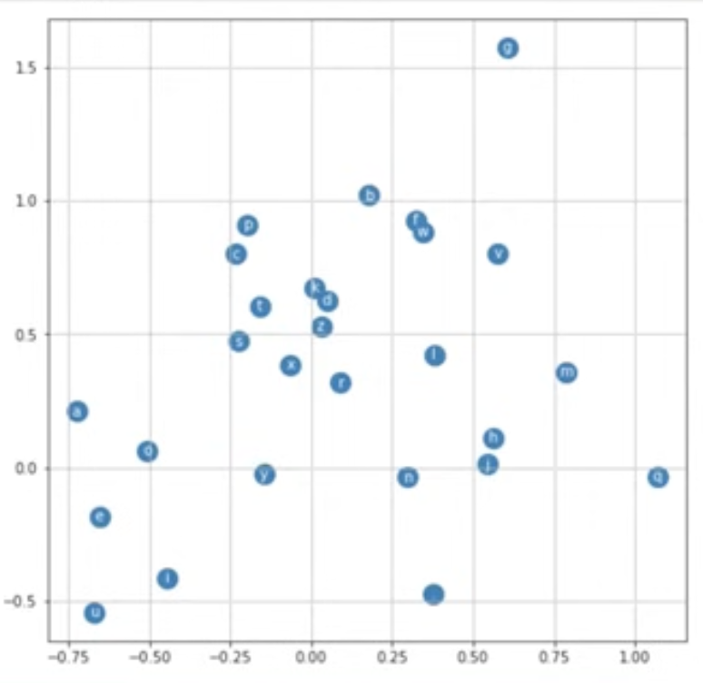

# Makemore Part 2 - MLP

Consider a trigram language model. If you remember the table from makemore part1, it had a cell for each pairing of characters. A given cell told us how many times the second character comes after the first character. If we have a trigram language model, then we care about the predicting the next character given the two previous characters, resulting in a table that is (27 x 27) x 27. The issue with this is that its way too large and because there are so many cells, there will be many cells that don't have anything.

Instead, we will train an MLP to use the previous three characters to predict the next character.

This is based on the paper [Bengio et al. 2003](https://www.jmlr.org/papers/volume3/bengio03a/bengio03a.pdf). We are constructing a character-level LM, but in the paper they constructor a word-level LM with a vocabulary of 17,000. They represent each word in the vocabulary by a feature vector of some number of dimensions (e.g. 30).

They initialize the vectors so that they are in the vector space with some random embeddings. However, we tune the neural network so that similar words are close together in the embedding space.

Why does this work? Suppose when training we get "A dog was running in a room", but when we test the model we get "The dog was running in a". We have never seen this exact configuration of words before since "a" and "the" are different. However, the neural network may recognize that "a" and "the" are used in similar contexts and therefore put them close together in the embedding space. So, where we predict the next word, we will still get "room".

In the image above, we see the process of the inputs (three previous words) passing through our neural network. We input the indices for our words; that is, we have a vocabulary of size 17,000 so each word is given an index between 0 and 16,999.

Then we have a look-up table called C. The purpose of this look-up table is to take in the index-representation of a word and return the embedding-vector that represents it. If the feature vectors have dimension 30, then C will be a 17000 x 30 matrix, since the inputs are vectors of length 17000 and we want the outputs to be vectors of length 30, since that is the dimension of the embedding space.

The same look-up table C is used in each part of that first layer. Because we want to produce dimension-30 vectors, each of those parts is represented by 30 neurons. Therefore, in the first layer we have 90 neurons (this is a little confusing because it's three sets of identical neurons).

Next is the hidden layer. The size of the hidden layer is a hyperparameter. Finally, there is an output layer of 17000 neurons (because we want the probability distribution for the next word and there are 17000 words in the vocab). We softmax to get the probabilities.

When we are training, we have the labels for the actual next word given the previous three words, so we see what our model predicts as the probability of that word and compute loss (log-prob) with the actual word.

## Building the Network

We create our dataset by processing every name in our names dataset. From the name we create pairs, where the x is three consecutive characters and the y is the character after these three previous characters.

We build the look-up table C by initializing a 27 x 2 matrix from a normal distribution. We choose these dimensions because our vocabulary is of size 27 and we want to embed the vector in a two-dimensional space.

For our model, we differ slightly from the paper's because we pass the three previous characters together to receive a dimension-2 embedding of them (rather than receiving an embedding for each character).

The model itself is fairly simple and similar to makemore part1, however, one new thing is batching. If you try to run our standard training loop on all of the data, it takes a very long time. Instead, we can create batches (we did batches of size 32) and train the network on a new batch each iteration.
We create these batches by randomly sampling from the training data.

When using minibatches, the quality of the gradient is lower since its only an approximation of the actual gradient. However, in this case it's enough to produce good results.

Note that when you compute the loss on each iteration of the loop, you aren't getting the actual loss; you're just getting the loss on that batch. To compute the real loss, evaluate on the entire dataset.

We also test the affect of the learning rate by taking exponential steps of the learning rate. When we do this, we get the following plot:

Loss is on the y-axis and learning rate is on the x-axis.

This shows that when we have a very low learning rate, barely anything is happending. But when the learning rate is to large the loss begins increasing. The optimal learning rate seems to be between 0.1 and 0.2.

Typically, we separate our data set into

1. Training split (80%): Used for training.

2. Dev/validation split (10%): Used for tuning hyperparameters and choosing best version of model.

3. Test split (10%): Used to test the data; hidden during training. Used to evaluate performance of model. Should be used sparingly since you don't want to use it too many times, make adjustments, and start overfitting it.

## Adjusting Hyperparameters

There are several hyperparameters that we can adjust (though I don't in the code) to improve performance.

### Model size

After training, if the loss on the dev/test set is very similar to the loss on the training set, that usually means our network is quite small.

Firstly, we can increase the size of the of the neural network by adding more neurons to the hidden layer (right now the hidden layer outputs an arbitrary number of outputs).

### Size of Embedding Space

Another hyperparameter that might be affecting performance is the size of our embedding space. Currently, we're embedding in a two-dimensional space and there's just too much information being crammed in there.

Observe the image above. This shows how our model embeds each of the letters in 2-space. One interesting observation is that all the vowels are grouped together in the bottom left corner.
