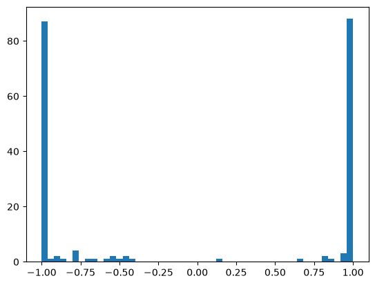
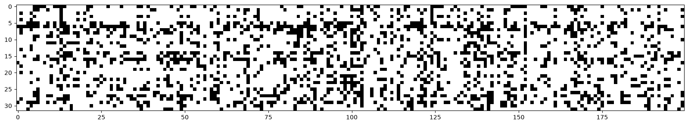
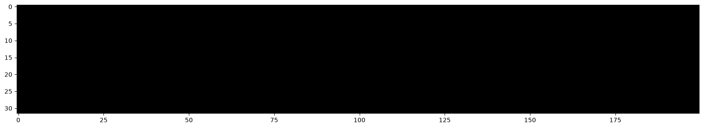
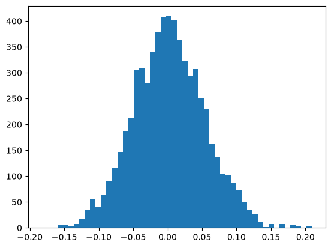

# makemore_part3 - RNNs

### softmax confidently wrong

The first thing we do is observe how the intitial loss when training the MLP from makemore_part2 is very high. This is because we randomly initialize all the parameters of the model.

We except to get a loss around -log(1/27) since a naive baseline is when all characters have the same probability of occurring for any set of three previous characters. Then the loss is just the negative log of 1/27.

Recall that our original code for creating the MLP is:

```python
n_embd = 10
n_hidden = 200

C = torch.randn((vocab_size, n_embd), generator=g)
W1 = torch.randn((n_embd * block_size, n_hidden), generator=g)
b1 = torch.randn(n_hidden, generator=g)
W2 = torch.randn((n_hidden, vocab_size), generator=g)
b2 = torch.randn(vocab_size, generator=g)
```

We have a lower initial loss if `logits = h @ W2 + b2` has all of its elements closer to 0. This is because we get the probability distribution (from which we calculate the loss) from the logits through a softmax. If all of them are 0 or close to 0, then all the probabilities from out to be the same, giving us a loss comparable to the naive baseline.

Therefore, to get the logit values closer to 0, we can initialize b2 as 0 and W2 as quite small. This is shown below:

```python
n_embd = 10
n_hidden = 200

C = torch.randn((vocab_size, n_embd), generator=g)
W1 = torch.randn((n_embd * block_size, n_hidden), generator=g)
b1 = torch.randn(n_hidden, generator=g)
W2 = torch.randn((n_hidden, vocab_size), generator=g) * 0.1
b2 = torch.randn(vocab_size, generator=g) * 0
```

Retraining with this initialization provides a much better initial loss.

### tanh layer too saturated

Next, we can analyze `h = torch.tanh(hpreact)`, which is the matrix after passing through the tanh activation in the hidden layer. Below is a histogram showing the values in the h matrix after the first epoch.



The issue with this is that most of the h values are at -1 or 1. This is a substantial issue because at -1 and 1, tanh has a nearly 0 slope. Because of this, when we try to calculate the gradient, it will be very small.

You can also remember that 1 - t^2 is used when calculating the gradient of tanh, so if t = -1,1, the gradient will be very small.

This makes it so the gradient of parameters in further back layers are also very small. The backward gradient is destroyed.

Another helpful visual is to see which neurons are "over-stimulated" (by seeing which values in the vectors of h have absolute values greater than 0.99)



There is a row for each example, and a column for each of the 200 neurons in the hidden layer.

For all the cells that are white, that means that the neuron for that example is in one of the tails of tanh, resulting in the backward gradient being destroyed.

It's especially bad if there is a column that is completely white, since that means the neuron doesn't become activated for any of the training examples.

A neuron is said to be dead if it never activates and always sits in the tails of its activation function.

The issue is that `hpreact = embcat @ W1 + b1` is too far from 0, resulting in tanh outputting values in its tails. Therefore, we want the preactivation to be closer to 0, so we can initialize the weights `W1` and biases `b` to be much smaller.

After making these adjustments, we get:





The post activation values are now not in the tails.
