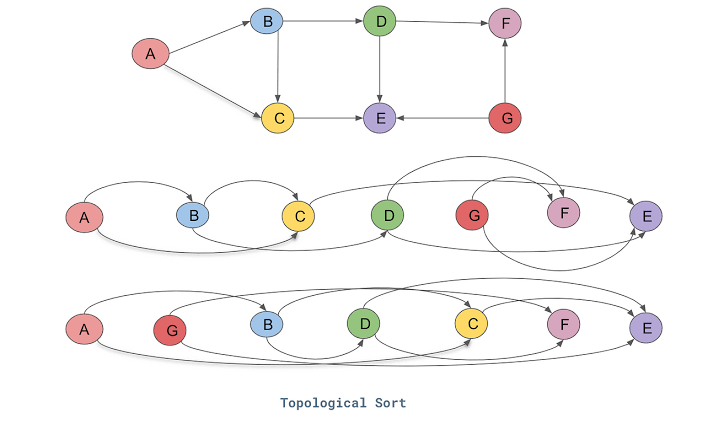
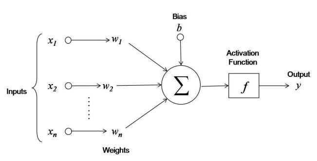
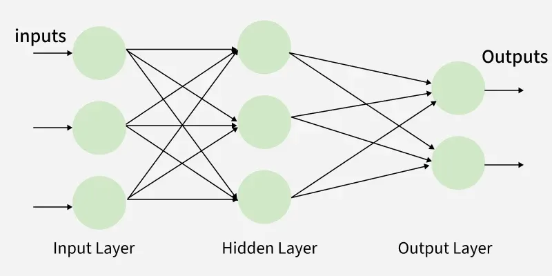

# Micrograd

Micrograd is a simplified version of autograd (which is a software engine that simplifies the process of producing gradients in neural networks).
It is different in that it operates on the level of scalars rather than tensors.

The bulk of micrograd is in the Value class. A Value is a scalar that we define to be a component of the neural net.

The important features of a Value object are:

- data - The scalar value the object repesents

- children - The Value object(s) that comprise the given object

- grad - This is the value of the gradient of the original function (in the context of a neural net this would be a loss function) with respect to the target value.

- \_op - The operation used to create the target object

-\_backward - The function that is used for backpropagating through the target object

Then we define several functions in the Value class so that we can perform operations between Value objects.

For instance, we define the addition between two objects as:

```python
def __add__(self, other):
        other = other if isinstance(other, Value) else Value(other)
        out = Value(self.data + other.data, (self, other), '+')

        def _backward():
            self.grad += 1.0 * out.grad
            other.grad += 1.0 * out.grad

        out._backward = _backward
        return out
```

`__add__` is called when we add two Value objects. For instace, you can think of `a + b` as `a.__add__(b)`, so that `a` is "self" and `b` is "other".
The first line makes it so that we can add a Value object with a standard scalar (we just cast that scalar into a Value object).

`out` is the object that we're returning. In this case, its data is the sum of the datas of the two things we're adding. Additionally, its children are the two Value objects involved in the addition.

One of the most important parts of this snippet is that we define a backward function, which is used when we perform backward propagation through this Value object.

Suppose we have `c = a + b` and we want to backpropagate through c. The gradient of c is 1 since its derivative is 1 relative to itself.
To find a.grad, we take the derivative of c with respect to a. This gives 1 since $\dfrac{dc}{da} = \dfrac{da}{da} + \dfrac{db}{da} = 1 + 0 = 1$. This is a very simple example because a and b are the children of c, however, if create a more complicated expression from which we start the backpropagation, then we will use that `out.grad` term.

First, we define multiplication as:

```python
def __mul__(self, other):
        other = other if isinstance(other, Value) else Value(other)
        out = Value(self.data * other.data, (self, other), '*')

        def _backward():
            self.grad += other.data * out.grad
            other.grad += self.data * out.grad
        out._backward = _backward
        return out
```

Consider the expression

```python
a = Value(-4.0)
b = Value(2.0)
c = Value(3.0)

d = a + b
e = c * d
```

Now, we wish to backpropagate starting at e. This means we want to find the derivative of e with respect to a, b, c, and d. First, note that e.grad = 1 because of the reasoning we outlined previously. Then observe that $\dfrac{de}{dc} = d$ and $\dfrac{de}{dd} = c$ by the basic derivative multiplication rule. So we get `c.grad = -2.0` and `d.grad = 3.0` since those are the values of d and c, respectively.
Next, we have `a.grad = 1.0 * d.grad = 3.0` and `b.grad = 1.0 * d.grad = 3.0`.

So, to find the gradient corresponding to a certain Value instance, we use the backward functions for all the objects that involve that instance.

These examples highlight the importance of the backward function that is assigned the output of each operation function.

The Value class has a single `backward` function which performs backward propagation through a target object. It does this by first sorting the nodes via topological sort. Topological transforms the graph corresponding to the network so that they are arranged linearly so that every node appears before the node it points to. With this sorted list, we can perform backprop in the proper order (The gradient of a parent node must be calculated before the gradients of its children)



That pretty much finishes the Value class, so next define Neuron, Layer, and MLP.

A neuron is the basic computational unit of a neural network. It takes in inputs, performs some mathematical operation on them, then returns the result to the next layer.



We define a neuron as:

```python
class Neuron:
    def __init__(self, nin):
        self.w = [Value(random.uniform(-1,1)) for _ in range(nin)]
        self.b = Value(random.uniform(-1,1))

    def __call__(self, x):
        act = sum((wi*xi for wi,xi in zip(self.w, x)), self.b)
        out = act.tanh()
        return out

    def parameters(self):
        return self.w + [self.b]
```

The neuron takes in `nin` inputs. We generate `nin` weights from a normal distribution with mean -1 and standard deviation 1, as well as a bias `b` from the same distribution.

To call the neuron on some vector of inputs (objects from the Value class) means finding the linear combination of the weights and the input values (along with the bias), then passing it through an activation function (in this case, tanh). We return a Value object corresponding to this value.

The `parameters` function returns a list of the weights and the bias.

The definition of a layer is fairly straightforward.

A multilayer percetrons is a sequence of fully-connected layers of neurons.



We define a multilayer perceptron as:

```python
class MLP:

    def __init__(self, nin, nouts):
        sz = [nin] + nouts
        self.layers = [Layer(sz[i], sz[i+1]) for i in range(len(nouts))]

    def __call__(self, x):
        for layer in self.layers:
            x = layer(x)
        return x

    def parameters(self):
        return [p for layer in self.layers for p in layer.parameters()]
```

nin is a scalar representing the number of inputs and nouts is a list consisting of the number of neurons in each layer. Then we create `nouts` layers.

The way we call the MLP is very interesting. If `x` is a vector of inputs, then we iterate through the layers of the MLP and iteratively compute the new output. For example if there are 3 layers to our MLP (two hidden layers and one output layer), then the first time we call `x = layer(x)`, x becomes the outputs of the first layer. After the next iteration, `x` is the outputs of the second layer. In the final iteration, we call `x = layer(x)` so that x is the value of the ouput(s).

Finally, consider a training loop:

```python
for k in range(20):
    # forward pass
    ypred = [n(x) for x in xs]
    loss = sum((yout - ygt) ** 2 for ygt, yout in zip(ys, ypred))

    # set grads to zero
    for p in n.parameters():
        p.grad = 0.0

    # backward pass
    loss.backward()

    # update
    for p in n.parameters():
        p.data += -0.05 * p.grad

    print(k, loss.data)
```

The first step is the forward pass, we pass in the inputs and compute the values of the all the nodes as tehey pass through the layers to the output. Then we compute the loss using mean squared loss by comparing out predictions with the ground truth outputs. Next, we set the gradients to be 0 since they may still be set the values of the gradients from the previous iteration of the training loop. These don't contribute to the current gradients. Next, we perform the backward pass on the loss to get the gradients of all the intermediate nodes. In particular, we are calculating the gradients on the weights and biases since these influence our predictions (the inputs can't change so we don't care about their gradients). Finally, we update the parameters according to their gradients. The gradient of the loss relative to a parameter points in the direction of the greatest increase with respect to that parameter, so we wish to go in the opposite direction of the gradient. This is why we subtract from the parameter's value the gradient times some learning rate.

In summary, the general process of the training loop is:

1. Forward pass

2. Backward pass

3. Update parameters
